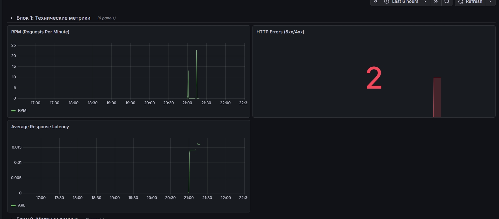
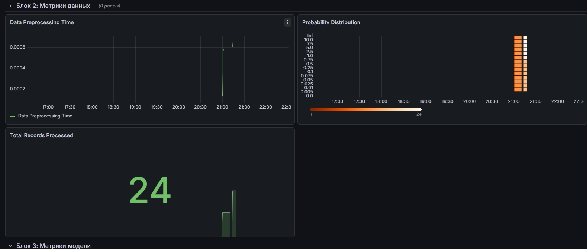
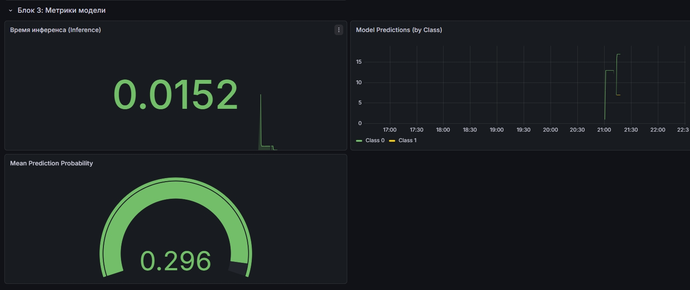
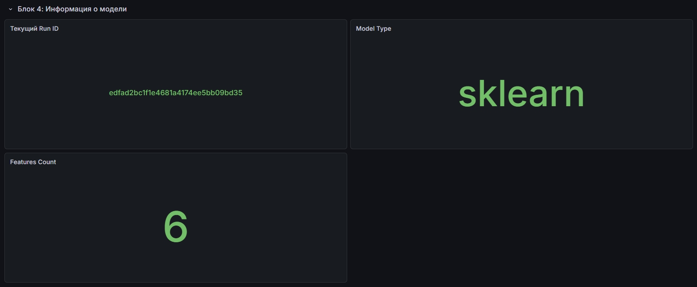
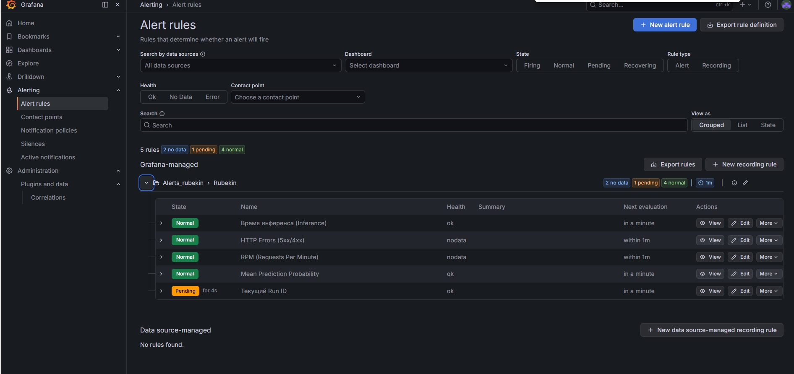
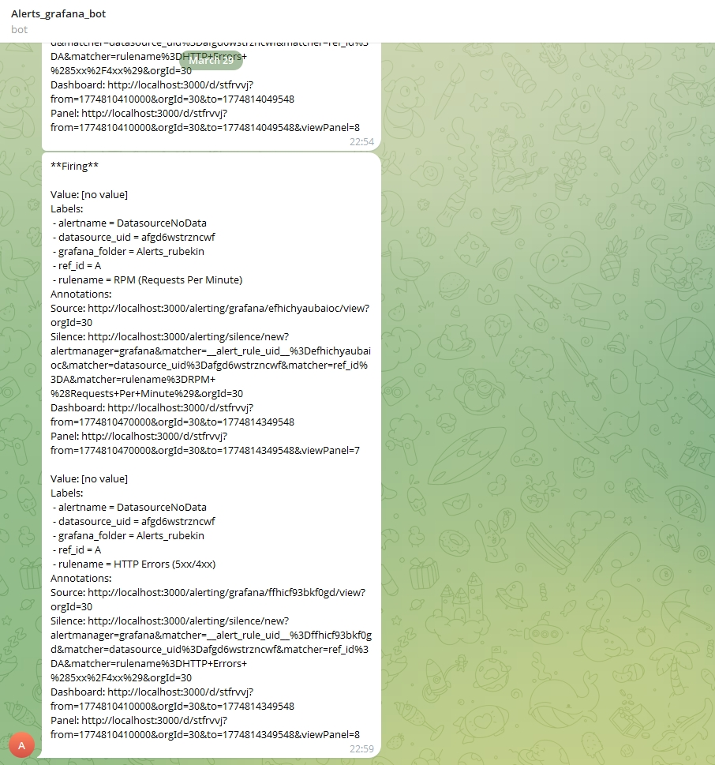
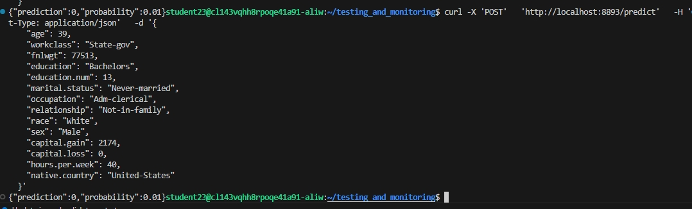

# MLflow + FastAPI service

Сервис на FastAPI, который:
- при старте приложения загружает ML‑модель из MLflow
- имеет хэндлер `POST /predict` &mdash; принимает на вход признаки
- имеет хэндлер `POST /updateModel`, который принимает `run_id` и подменяет текущую модель на модель из этого run

## Переменные окружения

- **`MLFLOW_TRACKING_URI`**: URI вашего MLflow Tracking Server (например, `http://158.160.2.37:5000/`)
- **`DEFAULT_RUN_ID`**: то модель загрузится из запуска с этим ID

## Запуск

Через docker compose:

```bash
export MLFLOW_TRACKING_URI=http://158.160.2.37:5000/
export DEFAULT_RUN_ID=<your_run_id>
docker compose up --build
```

Сервис будет доступен на `http://<ip>:1488`.


Дашборд 








Алерты




В телегу алерты приходят 




Прогнозы работают 



